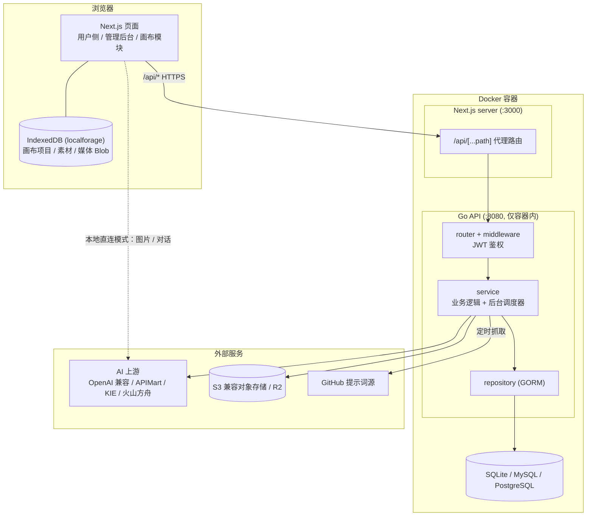
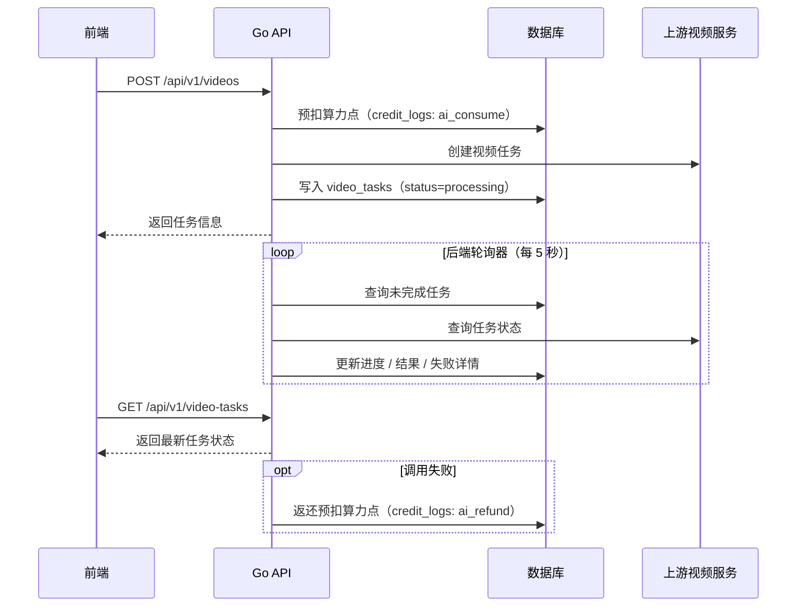
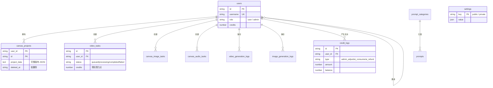

# 无限画布架构设计文档

本文档描述 infinite-canvas 项目的整体架构、模块职责、接口与数据设计、运行部署方式以及关键设计取舍，供设计评审和新加入的前后端工程师建立系统全貌。

## 1. 文档定位

**覆盖范围**：Go 后端（`Go/`）、Next.js 前端（`next/`）、数据库与浏览器本地存储、Docker 部署形态、安全与可靠性设计。

**不覆盖范围**：产品功能清单（见 `docs/overview/features.md`）、具体 API 字段级说明（见 `docs/backend/`）、画布操作手册（见 `docs/canvas/`）。

**证据约定**：本文事实性内容均来自当前代码库与项目文档，等同 `[Data-backed]`；标注 `[Expert judgment]` 的内容为对设计动机的推断；标注 `[Hypothesis]` 的内容为演进方向的假设。项目处于开发阶段，不保证历史数据兼容，本文描述以当前版本为准。

**术语表**：

| 术语 | 含义 |
| --- | --- |
| 渠道（channel） | 一个 AI 上游服务接入点，含协议、地址、密钥和可用模型列表，配置在 `settings.private` |
| 算力点（credits） | 后端模型调用的计量单位，调用前按模型配置预扣，失败返还 |
| 画布项目（canvas project） | 一份完整画布文档，含节点、连线、助手会话、视口 |
| storageKey | 媒体文件的长期标识，浏览器本地模式下指向 IndexedDB 中的 Blob，云端模式下指向对象存储 key |
| 双存储模式 | 未登录时数据仅存浏览器本地，登录后同步到服务端 |

## 2. 系统总体架构

系统采用前后端分离的模块化单体架构：后端是一个 Go 单体服务，内部按 handler → service → repository 严格分层；前端是一个 Next.js 应用，同时承担页面渲染和 API 代理。生产部署时两者打包进同一个 Docker 容器，由入口脚本拉起两个进程。



*图 1：系统总体架构*

请求主链路自上而下：浏览器中的页面组件通过 `services/api` 发起请求，Next.js 服务端的代理路由把 `/api/*` 转发到容器内的 Go API；Go API 经过 JWT 鉴权中间件后进入分层处理，最终落库或访问外部服务。图中有两条特殊通路：其一，图片生成和对话支持前端携带本地保存的 Key 直连 OpenAI 兼容接口，图片流量不经过后端；其二，浏览器本地的 IndexedDB 承载未登录状态下的全部业务数据，与云端构成双存储模式。

**技术选型与理由**：

| 选型 | 版本 | 用途 | 选择理由 |
| --- | --- | --- | --- |
| Go + Gin | Go 1.25 / Gin 1.11 | 后端 HTTP 服务 | 编译为单二进制，容器体积小、启动快；Gin 路由与中间件能力满足单体 API 场景 `[Expert judgment]` |
| GORM | 1.31 | ORM 与迁移 | 一套代码切换 SQLite/MySQL/PostgreSQL；开发期表结构频繁调整，`AutoMigrate` 免手写迁移脚本 |
| golang-jwt / robfig-cron | v5 / v3 | 认证与调度 | 标准库级轻量依赖，覆盖登录态与四类后台任务的定时触发 |
| Next.js App Router | 16.2.9 | 前端框架与 API 代理 | 服务端代理路由统一转发后端请求，避免浏览器直连后端端口和跨域配置 |
| React 19 + Ant Design 6 + Tailwind 4 | — | UI 层 | antd 提供后台管理类组件密度，Tailwind 承载画布侧自定义交互样式 |
| Zustand | 5 | 全局状态 | 轻量无样板代码，配合持久化中间件覆盖本地存储场景 |
| localforage | 1.10 | IndexedDB 封装 | 业务数据（画布、素材、媒体 Blob）需要超过 localStorage 容量上限的结构化存储 |
| bun | 1.3.14 | 前端包管理与构建 | 安装与构建速度快，lockfile 保证 Docker 构建可复现 |

## 3. 后端模块设计

后端按四个包组织，依赖方向单向：`router → middleware → handler → service → repository → model`，禁止反向引用。

| 层 | 职责边界 | 关键内容 |
| --- | --- | --- |
| `config/` | 环境变量与 .env 加载 | `Load()`：godotenv + env 解析；JWT 密钥缺省时自动生成随机值；Docker 内 SQLite DSN 路径归一化到 `/app/data` |
| `router/` | 路由组装 | `New()` 挂载公开路由、`/api/v1`（UserAuth）、`/api/admin`（AdminAuth）三组，以及 `NoRoute` 统一 404 JSON |
| `middleware/` | 鉴权与请求上下文 | `UserAuth`（拒绝游客）、`OptionalAuth`（可选附加用户）、`AdminAuth`（要求 admin 角色）；均从 `Authorization: Bearer` 提取 token 交给 `service.CurrentAuthUser` 校验，并通过 `service.WithUser` 注入 context |
| `handler/` | HTTP 薄层 | 只做入参解析、调用 service、以 `OK` / `Fail` 返回；`parseQuery` 把 page/pageSize/keyword/tag/category/source/type 归一为 `model.Query` |
| `service/` | 业务核心 | 鉴权签发、算力点预扣返还、渠道选择、上游协议适配、后台调度器、SSRF 防护 |
| `repository/` | 数据访问 | 每张表一个文件，只含 GORM 查询 |
| `model/` | 数据结构 | 表结构体、枚举；列表查询统一走 `model.Query` + `Normalize` 分页约定 |

**启动流程**（`main.go`）：`config.Load()` → `service.EnsureDefaultAdmin()`（无管理员时按环境变量创建）→ 启动提示词同步调度器 → 启动画布项目清理调度器 → 启动视频任务轮询器 → `router.New().Run(":8080")`。初始化全部完成前不监听端口，配置错误直接 `log.Fatal` 退出。

**后台任务**是 service 层的另一类职责，共四组：

| 任务 | 触发方式 | 行为 |
| --- | --- | --- |
| 视频任务轮询器 | 启动即运行，每 5 秒 | 按 `status + created_at` 查询未完成任务，轮询上游更新进度、结果地址或失败详情；浏览器关闭不影响轮询 |
| 提示词同步调度器 | cron（默认每天 0 点） | 从 GitHub 远程分类拉取提示词写入 `prompts` 表，调度配置存于 `settings.private.promptSync` |
| 画布项目清理调度器 | 启动时 + 每天 | 物理删除软删除超过 7 天的画布项目 |
| AI 日志 / 存储容量巡检 | cron | 按设置定时清理 AI 调用日志；巡检存储提供方容量 |

视频生成是最复杂的异步链路，涉及算力点预扣、后端轮询与失败返还：



*图 2：视频生成任务生命周期*

这条链路把"任务态"放在服务端：前端只负责提交和查询，刷新或关闭页面后任务继续推进；画布节点刷新后凭任务表恢复节点状态。算力点采用预扣-返还模型，保证失败不扣费，流水全部落在 `credit_logs`（类型：`admin_adjust` / `ai_consume` / `ai_refund`）。

**渠道选择**：后端收到模型请求时，按模型名筛选 `settings.private.channels` 中启用且包含该模型的渠道，再按 `weight` 加权随机选一个，实现同模型多渠道负载分担。

## 4. 前端模块设计

前端按 Next.js App Router 路由组组织，用户侧与管理后台物理隔离在 `(user)` 和 `(admin)` 两个路由组中，各自拥有独立 layout 与导航。

**用户侧页面**（`(user)/`）：

| 页面 | 职责 |
| --- | --- |
| `canvas/` | 核心模块。`page.tsx` 是画布项目库（新建、导入导出、删除）；`[id]/canvas-client-page.tsx` 渲染具体画布 |
| `image/` | 生图工作台：多任务并发、历史结果合并展示、参考图、复用"我的素材" |
| `video/` | 视频工作台，按模型能力动态渲染面板（如 Kling 专属工作台组件） |
| `workflows/` | 创作工作流：公开/个人模板、变量表单、AI 起草工作流 |
| `prompts/` | 提示词库浏览 |
| `assets/` | 我的素材管理 |
| `login/` | 登录注册 |

**管理后台**（`(admin)/admin/`）：layout 中完成路由守卫（非 admin 角色重定向），页面覆盖 users、channels（模型渠道）、model-pricing、assets、prompts、prompt-sources、storage、settings、ai-logs、credit-logs、preferences、advanced。

**画布模块**是系统核心，位于 `(user)/canvas/` 内部自治：

- `components/infinite-canvas.tsx`：画布容器主组件，负责视口变换、缩放平移、拖拽、网格背景与节点渲染；节点工具栏、设置弹窗、蒙版编辑、裁剪、放大等交互组件同目录拆分。
- `types.ts`：定义 8 种节点类型（`image` / `panorama` / `text` / `config` / `video` / `audio` / `director` / `group`）及节点元数据结构。
- `stores/use-canvas-store.ts`：画布项目 CRUD 与本地/云端同步（`syncWithRemote`）；`use-canvas-ui-store.ts` 管理画布内 UI 态。
- `agent/`：画布 AI Agent。`canvas-agent-runtime.ts` 驱动执行，`canvas-agent-tools.ts` 提供工具白名单（读写节点、连线、提交生成任务等），`canvas-agent-context.ts` 从画布状态汇总上下文，`skills/` 下 13 个技能手册（剧本、生图、单镜头/多镜头视频、视频续写/编辑、音频、分组整理等）以系统提示词形式注入，约束 Agent 只通过白名单工具操作真实画布。
- `utils/`：摄像机参数、导出、分组、图片数据、节点尺寸、全景图、资源引用等纯函数。

**全局状态**（`src/stores/`）：`use-user-store`（登录态与算力点）、`use-config-store`（AI 接口配置）、`use-theme-store`（明暗主题）、`use-asset-store`（我的素材）。画布私有状态留在画布目录内，不进全局。

**API 服务层**（`src/services/api/`）：`request.ts` 提供 `apiGet/apiPost/apiPut/apiDelete`，统一处理 token 注入、JSON 序列化、`{code, data, msg}` 错误消息；其余文件按域拆分（image、video、audio、canvas-tasks、canvas-agent、auth、admin 等）。浏览器发出的 `/api/*` 请求由 `app/api/[...path]/route.ts` 代理到 `API_BASE_URL`（默认 `http://127.0.0.1:8080`）。

**模型能力驱动的动态 UI**：管理后台为每个模型配置能力（图片比例与档位、视频分辨率/秒数/模式/面板类型、各类能力开关），保存在 `settings.public.modelChannel.modelCapabilities`；前端工作台按当前所选模型能力动态渲染表单项，模型切换时越界选项自动回退，未配置走默认值。视频面板类型（`kling-v26` / `seedance` / `grok` 等）取代前端按模型名硬编码判断。

## 5. 接口设计

**响应约定**：所有业务接口统一返回 `{ code, data, msg }`；`code=0` 成功（`msg="ok"`），`code=1` 失败。HTTP 200 也可能携带业务失败，前端以 `code` 判定。鉴权失败返回 HTTP 401 + `code=1`；未知路由返回 404 + `{code:1, msg:"接口不存在"}`。内部错误经 `FailError` 处理：实现了 `SafeMessage()` 的错误返回安全消息，其余统一返回"操作失败"并在服务端日志记录，避免内部细节外泄。

**鉴权模型**：JWT Bearer token，有效期默认 168 小时。三档中间件对应三类路由：

| 路由组 | 中间件 | 说明 |
| --- | --- | --- |
| `/api`（公开） | 无 / `OptionalAuth` | 登录注册、公开设置、媒体与文件读取、提示词与素材公开列表、图片代理 |
| `/api/v1`（业务） | `UserAuth` | 所有登录用户可用：AI 生成、画布项目与任务、工作流、用户配置、生成历史 |
| `/api/admin`（管理） | `AdminAuth` | 仅 admin 角色：用户与积分、系统设置、渠道、提示词源、素材管理 |

**代表性接口契约**：

| 字段 | 值 |
| --- | --- |
| 操作 | `POST /api/v1/videos` |
| 用途 | 创建视频生成任务 |
| 鉴权 | Bearer token，登录用户 |
| 请求体 | 模型名称、提示词、尺寸、秒数、参考媒体等，按模型能力校验 |
| 副作用 | 按 `modelCosts` 预扣算力点并写入流水；创建 `video_tasks` 记录 |
| 成功响应 | `{ code: 0, data: 任务信息, msg: "ok" }` |
| 失败响应 | `{ code: 1, data: null, msg: 失败原因 }`；预扣失败或上游创建失败时返还算力点 |

| 字段 | 值 |
| --- | --- |
| 操作 | `POST /api/v1/canvas/projects` |
| 用途 | 保存单个画布项目（整存整取） |
| 鉴权 | Bearer token，登录用户 |
| 请求体 | 完整 `CanvasProject` JSON（节点、连线、助手会话、视口） |
| 成功响应 | `{ code: 0, data: 保存结果, msg: "ok" }` |
| 并发策略 | 以 `(user_id, project_id)` 为主键覆盖保存，`updated_at` 决定同步新旧 |

**列表查询约定**：后台与列表类接口沿用 `model.Query`，统一支持 `page` / `pageSize` / `keyword` / `tag`（多值）/ `category` / `source` / `type` 参数，service 层 `Normalize` 归一化分页边界。

## 6. 数据设计

数据分布在三个位置：服务端关系数据库（业务账户、任务、配置、日志）、浏览器 IndexedDB（未登录及本地模式的画布与媒体）、S3 兼容对象存储（云端媒体文件）。登录用户的画布项目双写（本地 + 云端同步），媒体按存储配置决定落 S3 还是本地。

**服务端表**（启动时 `AutoMigrate` 自动维护，共 12 张）：

| 表 | 用途 | 关键设计 |
| --- | --- | --- |
| `users` | 用户与角色 | 含算力点余额、邀请关系、第三方登录标识（GitHub / Linux.do / 微信） |
| `credit_logs` | 算力点流水 | 记录每次变动前后余额，类型 `admin_adjust` / `ai_consume` / `ai_refund` |
| `settings` | 系统配置 | 仅两行：`public`（前端可读）与 `private`（仅后端/管理员） |
| `prompts` / `prompt_categories` | 提示词库 | 分类表驱动，远程分类绑定 GitHub 仓库，本地分类手动维护 |
| `assets` | 后台素材库 | 文本/图片/视频素材，供用户端复用 |
| `video_tasks` | 视频任务运行态 | 后端轮询器每 5 秒刷新，含预扣算力点与失败详情 |
| `video_generation_logs` / `image_generation_logs` | 生成成果历史 | 保存完整成果卡片 JSON；删除为软删除并清空 payload，保留 7 天阻止旧浏览器缓存恢复 |
| `canvas_image_tasks` / `canvas_audio_tasks` | 画布任务恢复 | 以 `(user_id, source, source_id, node_id)` 索引支撑节点级状态恢复 |
| `canvas_projects` | 画布项目 | 复合主键 `(user_id, id)`，整项目 JSON 存 `project_data`，不拆节点表 |



*图 3：核心数据实体关系*

除图中实体外，`settings` 与 `assets` 为独立配置/内容表，不与用户关联。`settings` 的双行设计是配置体系的枢纽：`public.value` 承载模型列表、默认模型、能力配置、渠道开关与登录开关，前端启动时拉取；`private.value` 承载渠道密钥与提示词同步调度，接口返回时隐藏敏感字段。配置按后端结构体序列化，数据库 JSON 中的未知旧字段会被忽略，配合"不保证旧数据兼容"的开发期策略，改结构无需迁移脚本。

**画布数据结构**（前端 TypeScript，云端以原样 JSON 存入 `canvas_projects.project_data`）：

```ts
type CanvasProject = {
  id: string;
  title: string;
  nodes: CanvasNodeData[];        // 8 种节点类型
  connections: CanvasConnection[]; // 只存节点 ID 对，渲染时按几何计算路径
  chatSessions: CanvasAssistantSession[];
  activeChatId: string | null;
  backgroundMode: "lines" | "dots" | "blank";
  viewport: { x: number; y: number; k: number };
};
```

媒体文件遵循 `storageKey` 机制：画布 JSON 不内联 base64 大对象，只保存展示 URL、`storageKey` 与元信息；真实 Blob 存在 localforage 的 `image_files` / `media_files` store（数据库名 `infinite-canvas`）。打开画布时按 `storageKey` 补水生成 `blob:` URL，旧数据的 data URL 自动迁移。删除媒体采用引用计数清理（`cleanupImages`）：收集仍被画布、素材、助手会话引用的全部 key，未被引用的才真正删除，避免同一文件多处引用时误删。

**软删除策略**：画布项目软删除超 7 天物理清理（启动时 + 每日调度）；生成历史软删除时清空 payload JSON 并保留 7 天，用于拦截旧浏览器缓存把已删除记录恢复回来。

## 7. 运行与部署

**本地开发**（前后端分离运行）：

```bash
# 后端：Go/.env 提供配置，监听 :8080
cp .env.example Go/.env
cd Go && go run .

# 前端：bun 安装依赖，监听 :3000，/api/* 代理到 API_BASE_URL
cd next && bun install && bun run dev
```

**Docker 部署**（推荐，单容器全栈）：

```bash
cp .env.example .env   # 修改管理员账号、JWT_SECRET 等
docker compose up -d --build
# 访问 http://localhost:3000，数据持久化在宿主机 ./data
```

镜像采用三阶段构建：`oven/bun` 阶段构建 Next.js standalone 产物；`golang:1.25-alpine` 阶段编译后端单二进制；`node:22-bookworm-slim` 运行镜像只暴露 3000 端口。容器入口 `docker-entrypoint.sh` 先后拉起 Go API（:8080，仅容器内可达）与 Next.js server（:3000，对外），任一进程退出则整体优雅退出。`docker-compose.local.yml` 提供从本地源码构建的变体；`render.yaml` 支持 Render 平台部署。

**环境变量**：

| 变量 | 默认值 | 说明 |
| --- | --- | --- |
| `ADMIN_USERNAME` / `ADMIN_PASSWORD` | admin / infinite-canvas | 首次启动自动创建管理员 |
| `JWT_SECRET` | infinite-canvas | 缺省或保持默认时启动自动生成随机密钥（重启会使已发 token 失效，正式部署应显式配置） |
| `JWT_EXPIRE_HOURS` | 168 | token 有效期 |
| `PORT` | 8080 | 后端监听端口；容器内前端固定 3000 |
| `STORAGE_DRIVER` / `DATABASE_DSN` | sqlite / data/infinite-canvas.db | 支持 sqlite / mysql / postgresql；MySQL/PG 目标库不存在时自动创建 |
| `PUBLIC_BASE_URL` | 空 | 站点根地址，供火山方舟回源拉取 Seedance 参考图/视频（`/api/media/references/:id`） |
| `API_BASE_URL` | http://127.0.0.1:8080 | 前端开发代理目标 |
| `AI_LOG_DIR` | data/logs/ai-calls | AI 调用日志目录，定时清理 |

## 8. 非功能设计

**安全**：

- 认证基于 JWT，三档中间件区分公开/登录/管理员路由；管理后台前端再做一层角色守卫。
- 渠道密钥只存 `settings.private`，管理接口返回时隐藏；内部错误统一脱敏为"操作失败"，细节只进服务端日志。
- 外链拉取经 `service/ssrf.go` 做内网地址防护，阻止以服务端身份访问内网。
- 前端直连模式下的用户 API Key 保存在浏览器本地，由前端直接请求 OpenAI 兼容接口；该模式适合个人或可信环境，多租户公开部署应关闭自定义渠道开关，统一走云端渠道。
- 权限开关（`allowCustomChannel` / `allowUserRemoteChannel` / `allowGuestConfig`）只约束普通用户，管理员始终不受限。

**可靠性**：

- 异步生成任务（视频/画布图片/画布音频）的任务态落在服务端任务表，由后端轮询器推进，前端刷新或关闭浏览器不中断生成；画布节点刷新后凭任务记录恢复状态。
- 算力点预扣-返还模型保证失败不扣费，每笔变动有流水可审计。
- 双存储模式下本地数据是第一事实来源，登录后按 `updated_at` 新旧同步，云端异常不阻塞本地创作。

**性能取向**：

- 图片流量可走前端直连，后端不中转图片字节，带宽压力集中在 AI 上游与浏览器之间。
- 多图生成（n>1）由前端拆成并发单图请求（`Promise.allSettled`），规避上游模型对 n 参数的限制，同时部分失败不影响已成功结果。
- 画布项目整存整取，单行 JSON 读写避免按节点查询的 N+1；本地 IndexedDB 承担高频读写，云端只在保存时同步。

**可观测**：AI 调用日志（`ai-logs`）记录模型、渠道、耗时与结果，支持后台检索和定时清理；算力点流水（`credit-logs`）构成资金侧审计；任务表自带 `error_detail` / `last_polled_at` 等排障字段。当前未接入 metrics/tracing，排障依赖结构化日志与数据库现场 `[Hypothesis: 后续可按需引入]`。

## 9. 关键设计取舍

| 决策 | 备选方案 | 采用理由 | 代价 |
| --- | --- | --- | --- |
| 单容器双进程部署 | 前后端独立容器编排 | 一条 `docker compose up` 起全栈，自部署门槛最低，契合开源个人部署场景 `[Expert judgment]` | 进程间无资源隔离，任一崩溃整体退出；横向扩展需拆部署形态 |
| `settings` 只存 public/private 两行 JSON | 配置项拆多表 | 管理后台配置形态多变，JSON 免频繁改表；公私分层同时满足前端读取与密钥隔离 | 无法在 SQL 层按配置字段查询统计 |
| 画布项目整行 JSON 存储 | 拆 nodes/connections 关系表 | 画布是整存整取的文档型数据，单行读写天然避免部分更新的一致性问题 | 无法按节点粒度服务端查询，多人文实时协作不可行 `[Hypothesis]` |
| 图片/对话支持前端直连上游 | 全部流量代理走后端 | 后端不背图片带宽；用户可自带 Key 快速上手 | Key 暴露在浏览器，只适合个人/可信场景，公开多租户需关闭 |
| SQLite 作为默认数据库 | 强制外部数据库 | 零运维开箱即用，单文件备份 | 并发写上限低，大流量需切换 MySQL/PostgreSQL |
| `AutoMigrate` + 不保证旧数据兼容 | 版本化迁移脚本 | 开发期表结构直接调整，维护成本最低 | 升级可能不兼容历史数据，需用户自行备份 |
| 媒体引用计数清理 | 删除节点即删文件 | 同一媒体可被画布、素材、助手多处引用，计数清理避免误删 | 清理是全量扫描，媒体规模极大时有延迟 `[Hypothesis]` |
